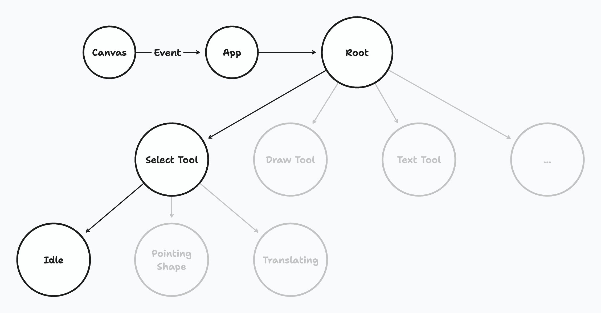

# tldraw 文档
## Editor
使用[Editor](https://tldraw.dev/reference/editor/Editor) 类，通过这个类可以控制编辑器内部的`状态`、提交修改以及对编辑器状态的变化做出响应。

`Editor`的功能非常强大，可以通过[Edtor.createShapes](https://tldraw.dev/reference/editor/Editor#createShapes) 创建图形（shape)，可以通过`Editor.deleteShapes`删除图形，通过`Editor.getCurrentPageShapesSorted`对当前页面的图形进行排序。

## Store

编辑器状态记录在`Editor.store`属性内，数据以`JSON`对象的形式保存。举例，`store`为每一个页面保存一个`TLPage`的记录，一个`TLInstancePageState`的记录存储编辑器页面的状态和唯一的`TLInstance`保存编辑器的实例。

编辑器暴露出许多的`computed`值，这些值是通过其他值计算出来的。例如`Edtor.getSelectedShapeIds`方法可以获取当前页面选中图形的`id`。

```jsx
import { track, useEditor } from 'tldraw'

export const SelectedShapeIdsCount = track(() => {
	const editor = useEditor()

	return <div>{editor.getSelectedShapeIds().length}</div>
})
// 这里的`track`函数与`vue`中的`watchEffect`相似，如果编辑器的状态发生变化那么使用`track`包裹的组件会重新渲染
```

## 修改状态

`Editor`有大量的方法可以更新内部状态，例如，你可以使用`Editor.setSelectedShapes`修改当前页的选中图形，也可以使用`Editor.select`、`Editor.selectAll`、`Editor.selectNone`等操作图形的选中。
```js

editor.selectNone() // 取消所有选中
editor.select(myShapeId, myOtherShapeId) // 设置图形的选中
editor.getSelectedShapes() // [myShapeId, myOtherShapeId]
```
每次对状态的修改都会在一个事务（transation）内做出响应。所以最好通过`Editor.batch`方法将状态变化打包到一个事务里面。最好是所有可能的修改都打包处理，这样可以减少撤销重作的步骤以及持久化的数据。

## 监听变化

可以使用`Store.listen`监听`Editor.store`的变化。每个事务完成时编辑器都会带一个历史记录调用监听函数。这个历史记录包含`added`、`changed`、`deleted·还会表示这些变化是谁产生的例如`user`或者`remote`

```js
editor.store.listen(entry=> {
  entry // {changes, source}  changes 是事务结束的变化，source 是谁产生的变化
  // 这里的变化会包括鼠标悬停移动的数据，所以这个监听函数产生的数据量很大
})
```

## 远程变化

默认情况下，编辑器的变化都来自于`user`，当然也可以使用`Store.mergeRemotechanges`合并来自远程的状态变化。合并完成后`Store.listen`接收到的`source`属性会被标识成`remote`。

## 撤销重作

历史记录包含两种数据类型：`marks`和`commands`。`commands`有自己的`undo`和`redo`方法。

可以使用`Editor.mark`在历史记录中添加一个标记
```js

editor.mark('my-id')
// 做一些操作
editor.bailToMark('my-id')
```

当调用`Editor.undo`时，编辑器会撤销所有的操作直到上一个标记或者历史记录的栈顶。当调用`Editor.redo`时，编辑器会重作所有的操作直到下一个标记或者历史记录的栈底。

```js
// 标记 duplicate everything
editor.mark('duplicate everything')

editor.selectAll()
editor.duplicateShapes(editor.getSelectedShapeIds()) // 复制选中图形
// 栈底

editor.undo() // 返回标记 duplicate everything
editor.redo() // 返回栈底
```

可以调用`Editor.bail`撤销操作并删除第一个标记到当前标记的所有操作记录
```js

// 标记 duplicate everything
editor.mark('duplicate everything')

editor.selectAll()
editor.duplicateShapes(editor.getSelectedShapeIds()) // 复制选中图形
// 栈底

editor.bail() // 返回标记 duplicate everything
editor.redo() // 不做任何操作
```
可以使用`Editor.bailToMark` 撤销并删除栈底到指定标记的所有操作记录。
```js

// 标记 first
editor.mark('first')
editor.selectAll()
// 标记second
editor.mark('second')
editor.duplicateShapes(editor.getSelectedShapeIds())
// 栈底

editor.bailToMark('first') // 回到标记first
```
## 事件

`Editor`接收`Editor.dispatch`释放的事件。当`Editor`接收到事件时会首先更新内部的`Editor.inputs` 然后将事件传送进编辑器的`状态图`（state chart)。

不要自己写`Editor.dispatch`触发自定义事件，这样需要在状态图里面写代码处理这些事件。

### 状态图

`状态图`是一个`StateNode`的树状结构。当使用编辑器工具如选中工具、画图工具时，会进入到状态图。用户的交互操作像移动鼠标也会进入到这个状态图，状态图里的状态发生变化进而激活对应的节点。

树图里的每个状态节点都可以是激活或者不激活状态，每个节点也可以有0个或者多个子节点。一个状态节点激活时，子节点也会激活。一个节点接收到父级节点的事件时，它可以先处理事件然后将事件派发给激活的子节点。节点可以任意处理传递过来的事件如忽略该事件、更新store中的记录、激活某些其他节点。

当交互事件传入后，事件通过编辑器的`根状态节点`向下传递，直到事件进入状态图的叶子节点或者某个节点提交了一个事务（transaction)。

 


